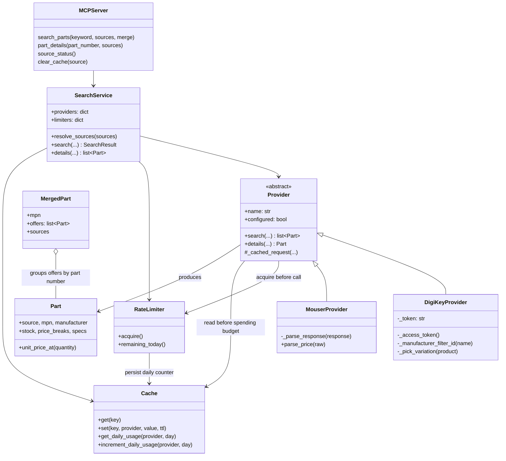
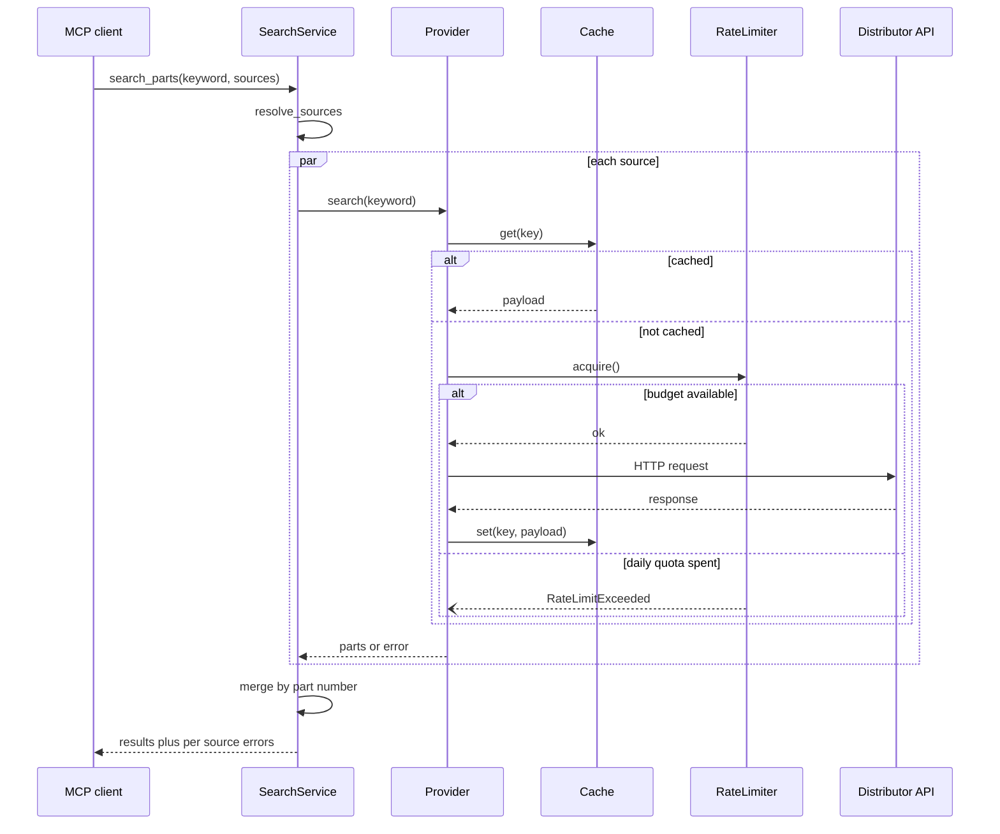

# digi-mouse-search

An MCP server that searches electronic components across DigiKey and Mouser.
Each distributor can be queried on its own or both together, with offers for
the same part number merged into a single entry so prices can be compared.

## Tools

| Tool | Purpose |
| --- | --- |
| `search_parts` | Keyword search across one or both distributors |
| `part_details` | Look up a single part by manufacturer or distributor part number |
| `source_status` | Which sources are configured, and how much request budget is left |
| `clear_cache` | Drop cached responses to force fresh stock and pricing |

`search_parts` takes a `sources` list. Omitting it searches every configured
distributor; passing `["mouser"]` searches that one alone. Results are merged
by part number by default, with a `cheapest_at_quantity` comparison; pass
`merge=false` to keep each distributor's results in a separate list.

If one distributor fails, is unconfigured, or is out of quota, the others
still return results and the failure is reported under `errors`.

## Setup

```sh
mise install
mise run install
mise run test
```

Credentials come from the environment:

```sh
# DigiKey: register an app at developer.digikey.com with Product Information enabled
export DIGIKEY_CLIENT_ID=...
export DIGIKEY_CLIENT_SECRET=...

# Mouser: request a Search API key from mouser.com/api-hub
export MOUSER_API_KEY=...
```

Only the credentials of the distributors you actually want are needed. A
source without credentials is reported as unconfigured rather than failing
the search.

### Getting credentials

**DigiKey.** A personal developer app only ever gets sandbox access, and the
sandbox returns synthetic data. For real stock and pricing you need a
Production app, which lives under an Organization:

1. Sign in at developer.digikey.com with your DigiKey account.
2. Open **Organizations** on the nav bar and create one if you are not
   already a member.
3. Under **Operations**, choose **Production Apps**, then **Create Production
   App**.
4. Enable **Product Information** for the app.
5. Open the app to copy its **Client ID** and **Client Secret**.

The OAuth callback field is only used by three-legged OAuth. This server uses
the two-legged client credentials flow, so the callback is never redirected
to; `https://localhost` satisfies the form.

Sandbox and production credentials are not interchangeable. Sandbox
credentials work only against `sandbox-api.digikey.com`, which is what
`DIGIKEY_SANDBOX=true` selects.

**Mouser.** Request a Search API key at mouser.com/api-hub. It is a single
key, sent as a query parameter, and arrives by email.

### MCP client configuration

```json
{
  "mcpServers": {
    "digi-mouse-search": {
      "command": "/path/to/digi-mouse-search/.venv/bin/python",
      "args": ["-m", "digi_mouse_search"],
      "env": {
        "DIGIKEY_CLIENT_ID": "...",
        "DIGIKEY_CLIENT_SECRET": "...",
        "MOUSER_API_KEY": "..."
      }
    }
  }
}
```

## Rate limits

Both distributors grant roughly a thousand calls per day, so every request is
budgeted. Per-second and per-minute windows are enforced by waiting; the daily
window is a hard stop that reports an error instead, since a caller cannot
usefully wait out a quota that resets at midnight. The daily counter is
persisted, so restarting the server does not reset it.

Defaults:

| Window | DigiKey | Mouser |
| --- | --- | --- |
| per second | 2 | 1 |
| per minute | 60 | 25 |
| per day | 1000 | 1000 |
| burst | 5 | 3 |
| max wait | 10 s | 10 s |

Every value is configurable per provider, either by environment variable or
by a TOML file. Use `none`, `off`, `unlimited` or `0` to disable a window:

```sh
export DIGIKEY_RATE_PER_DAY=250
export DIGIKEY_RATE_PER_MINUTE=30
export MOUSER_RATE_PER_SECOND=none
export MOUSER_RATE_BURST=5
export MOUSER_RATE_MAX_WAIT=30
```

Or point `DMS_CONFIG` at a file, see `config.example.toml`. Environment
variables override the file, so a client launch command can adjust a limit
without editing configuration on disk.

Cached responses are served without spending budget. `source_status` reports
what remains for the day.

## Other settings

| Variable | Default | Meaning |
| --- | --- | --- |
| `DMS_CONFIG` | unset | Path to a TOML configuration file |
| `DMS_CACHE_PATH` | `$XDG_STATE_HOME/digi-mouse-search/cache.sqlite3` | Cache and usage database |
| `DMS_CACHE_TTL` | 3600 | Cached response lifetime in seconds |
| `DMS_REQUEST_TIMEOUT` | 30 | HTTP timeout in seconds |
| `DIGIKEY_SANDBOX` | false | Use the DigiKey sandbox host, which returns synthetic data |
| `DIGIKEY_LOCALE_SITE` | US | DigiKey site to search |
| `DIGIKEY_LOCALE_CURRENCY` | USD | Currency for DigiKey pricing |
| `DIGIKEY_LOCALE_LANGUAGE` | en | Language for DigiKey results |

## Architecture



Request flow for one provider call:



## Notes on the two APIs

DigiKey uses OAuth2 client credentials. The token lasts ten minutes and is
cached in memory; requests need the client id header alongside the bearer
token. Filters are expressed as opaque ids, so a manufacturer name is first
resolved through the manufacturers endpoint.

Mouser uses an API key passed as a query parameter and answers with HTTP 200
even when the request failed, putting the failure in an `Errors` array. The
adapter treats that array as authoritative. Prices arrive as localized display
strings rather than numbers.

Parametric specifications have no shared vocabulary between the two
distributors, so they are passed through as a name/value map rather than
normalized into a common schema.


## Claude Code was used in the making of this tool.
