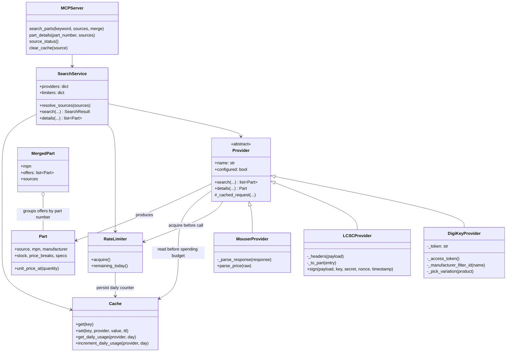
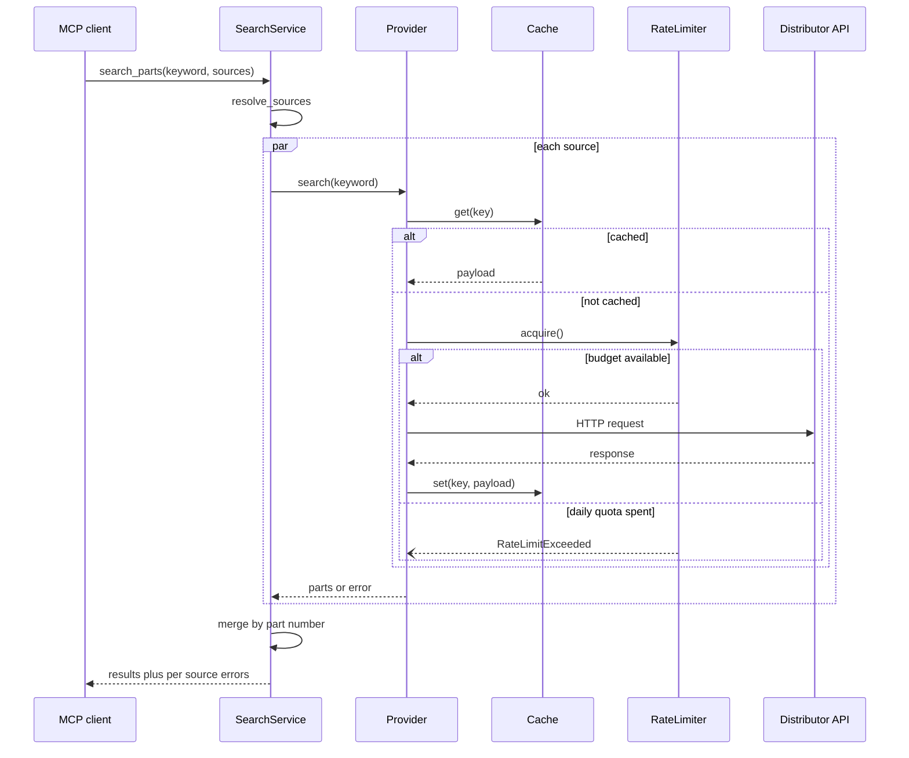

# eparts-search-mcp

An MCP server that searches electronic components across DigiKey, LCSC and
Mouser. Each distributor can be queried on its own or all of them together,
with offers for the same part number merged into a single entry so prices can
be compared.

## Tools

| Tool | Purpose |
| --- | --- |
| `search_parts` | Keyword search across one or several distributors |
| `part_details` | Look up a single part by manufacturer or distributor part number |
| `source_status` | Which sources are configured, and how much request budget is left |
| `clear_cache` | Drop cached responses to force fresh stock and pricing |

`search_parts` takes a `sources` list. Omitting it searches every configured
distributor; passing `["mouser"]` searches that one alone. Results are merged
by part number by default, with a `cheapest_at_quantity` comparison; pass
`merge=false` to keep each distributor's results in a separate list.

The comparison only considers offers that have a price at the quantity asked
for. LCSC sells many parts in multiples of ten, so at a quantity of one such
an offer has no applicable break and is left out of the comparison rather
than being counted as free.

If one distributor fails, is unconfigured, or is out of quota, the others
still return results and the failure is reported under `errors`.

## Installing

To use the server from anywhere on the system, install it as a standalone
tool. The executable lands in `~/.local/bin` (`$XDG_BIN_HOME` if set), with
its dependencies in their own environment under `~/.local/share/uv/tools`:

```sh
uv tool install .
```

`mise run install-tool` does the same, and `mise run uninstall-tool` removes
it. After installing, `eparts-search-mcp` runs the server on stdio from any
directory, reading credentials from the XDG config file described below.
Nothing outside `~/.local` and `~/.config` is touched, so no privileged
install step is needed.

Make sure `~/.local/bin` is on `PATH`:

```sh
export PATH="$HOME/.local/bin:$PATH"
```

## Development setup

For working on the server rather than using it:

```sh
mise install
mise run install
mise run test
```

Credentials can come from a config file or the environment. The file keeps
them out of the environment and process listings; it is read by default from
`~/.config/eparts-search-mcp/config.toml` (or `$XDG_CONFIG_HOME` if set), so
no `EPARTS_CONFIG` is needed:

```toml
# ~/.config/eparts-search-mcp/config.toml
[providers.digikey]
# DigiKey: register an app at developer.digikey.com with Product Information enabled
client_id = "..."
client_secret = "..."

[providers.lcsc]
# LCSC: partner credentials issued by an account manager
key = "..."
secret = "..."

[providers.mouser]
# Mouser: request a Search API key from mouser.com/api-hub
api_key = "..."
```

Because the file holds secrets, keep it readable only by you. The server warns
on startup if it is accessible to group or others:

```sh
chmod 600 ~/.config/eparts-search-mcp/config.toml
```

The same values may instead be supplied through the environment, which
overrides the file:

```sh
export DIGIKEY_CLIENT_ID=...
export DIGIKEY_CLIENT_SECRET=...
export LCSC_KEY=...
export LCSC_SECRET=...
export MOUSER_API_KEY=...
```

Only the credentials of the distributors you actually want are needed. A
source without credentials is reported as unconfigured rather than failing
the search.

### Getting credentials

**DigiKey.** A personal developer app only ever gets sandbox access, and the
sandbox returns synthetic data. For real stock and pricing you need a
Production app, which lives under an Organization:

1. Sign in at developer.digikey.com with your DigiKey account.
2. Open **Organizations** on the nav bar and create one if you are not
   already a member.
3. Under **Operations**, choose **Production Apps**, then **Create Production
   App**.
4. Enable **Product Information** for the app.
5. Open the app to copy its **Client ID** and **Client Secret**.

The OAuth callback field is only used by three-legged OAuth. This server uses
the two-legged client credentials flow, so the callback is never redirected
to; `https://localhost` satisfies the form.

Sandbox and production credentials are not interchangeable. Sandbox
credentials work only against `sandbox-api.digikey.com`, which is what
`DIGIKEY_SANDBOX=true` selects.

**LCSC.** The Open API is a partner integration rather than a self-service
signup, so credentials come from an LCSC account manager after the calling IP
address has been whitelisted. Onboarding starts in a test environment on a
separate host (`fatapi.lcsc.com`) that answers with simulated catalog data;
`LCSC_SANDBOX=true` selects it. Production credentials arrive once the
integration is signed off, and are used against `api.lcsc.com`.

A call is authenticated by a SHA-256 signature over the request parameters,
the key, a per request nonce and a timestamp. The secret is an input to that
hash and is never transmitted, so it never appears in a URL or a log; the
timestamp is checked, meaning a badly wrong system clock reads as an expired
request rather than a rejected key.

**Mouser.** Request a Search API key at mouser.com/api-hub. It is a single
key, sent as a query parameter, and arrives by email.

### MCP client configuration

Once installed as above, the command is on `PATH` and needs no path or
environment, since credentials come from the config file:

```json
{
  "mcpServers": {
    "eparts-search-mcp": {
      "command": "eparts-search-mcp"
    }
  }
}
```

Some clients launch servers with a bare environment that does not include
`~/.local/bin`; give the absolute path there instead:

```json
{
  "mcpServers": {
    "eparts-search-mcp": {
      "command": "/home/you/.local/bin/eparts-search-mcp"
    }
  }
}
```

To run from a source checkout without installing, or to pass credentials
through the client rather than the config file:

```json
{
  "mcpServers": {
    "eparts-search-mcp": {
      "command": "/path/to/eparts-search-mcp/.venv/bin/python",
      "args": ["-m", "eparts_search_mcp"],
      "env": {
        "DIGIKEY_CLIENT_ID": "...",
        "DIGIKEY_CLIENT_SECRET": "...",
        "MOUSER_API_KEY": "..."
      }
    }
  }
}
```

## Rate limits

Each distributor grants roughly a thousand calls per day, so every request is
budgeted. Per-second and per-minute windows are enforced by waiting; the daily
window is a hard stop that reports an error instead, since a caller cannot
usefully wait out a quota that resets at midnight. The daily counter is
persisted, so restarting the server does not reset it.

Defaults:

| Window | DigiKey | LCSC | Mouser |
| --- | --- | --- | --- |
| per second | 2 | 1 | 1 |
| per minute | 60 | 45 | 25 |
| per day | 1000 | 1000 | 1000 |
| burst | 5 | 5 | 3 |
| max wait | 10 s | 10 s | 10 s |

LCSC documents 60 keyword searches per minute and a thousand a day, and counts
only calls that succeed. Its per-minute default is set below the documented
ceiling, since being throttled by the distributor costs more than waiting
locally. When LCSC's own counter rejects a call anyway, the error says so, to
distinguish it from the local budget.

Every value is configurable per provider, either by environment variable or
by a TOML file. Use `none`, `off`, `unlimited` or `0` to disable a window:

```sh
export DIGIKEY_RATE_PER_DAY=250
export DIGIKEY_RATE_PER_MINUTE=30
export LCSC_RATE_PER_MINUTE=20
export MOUSER_RATE_PER_SECOND=none
export MOUSER_RATE_BURST=5
export MOUSER_RATE_MAX_WAIT=30
```

These also live in the config file (`~/.config/eparts-search-mcp/config.toml`
by default, or wherever `EPARTS_CONFIG` points), see `config.example.toml`. Environment
variables override the file, so a client launch command can adjust a limit
without editing configuration on disk.

Cached responses are served without spending budget. `source_status` reports
what remains for the day.

## Other settings

| Variable | Default | Meaning |
| --- | --- | --- |
| `EPARTS_CONFIG` | `~/.config/eparts-search-mcp/config.toml` | Path to a TOML configuration file; the default location is read when unset |
| `EPARTS_CACHE_PATH` | `$XDG_STATE_HOME/eparts-search-mcp/cache.sqlite3` | Cache and usage database |
| `EPARTS_CACHE_TTL` | 3600 | Cached response lifetime in seconds |
| `EPARTS_REQUEST_TIMEOUT` | 30 | HTTP timeout in seconds |
| `DIGIKEY_SANDBOX` | false | Use the DigiKey sandbox host, which returns synthetic data |
| `DIGIKEY_LOCALE_SITE` | US | DigiKey site to search |
| `DIGIKEY_LOCALE_CURRENCY` | USD | Currency for DigiKey pricing |
| `DIGIKEY_LOCALE_LANGUAGE` | en | Language for DigiKey results |
| `LCSC_SANDBOX` | false | Use the LCSC test host, which returns simulated data |
| `LCSC_CURRENCY` | USD | Currency for LCSC pricing: USD, EUR, HKD or CNY |
| `LCSC_LANGUAGE` | EN | Language for LCSC results: EN or CN |

### Files on disk

Everything the server keeps lives under the XDG base directories, so an
install owns nothing outside the home directory:

| What | Where |
| --- | --- |
| Executable | `$XDG_BIN_HOME`, i.e. `~/.local/bin/eparts-search-mcp` |
| Tool environment | `~/.local/share/uv/tools/eparts-search-mcp` |
| Credentials and settings | `$XDG_CONFIG_HOME/eparts-search-mcp/config.toml` |
| Cache and daily usage counters | `$XDG_STATE_HOME/eparts-search-mcp/cache.sqlite3` |

`XDG_CONFIG_HOME` and `XDG_STATE_HOME` default to `~/.config` and
`~/.local/state` when unset. `EPARTS_CONFIG` and `EPARTS_CACHE_PATH` override the
last two. Uninstalling with `uv tool uninstall eparts-search-mcp` leaves the
config and cache in place; delete those directories to remove them too.

## Architecture



Request flow for one provider call:



## Notes on the three APIs

DigiKey uses OAuth2 client credentials. The token lasts ten minutes and is
cached in memory; requests need the client id header alongside the bearer
token. Filters are expressed as opaque ids, so a manufacturer name is first
resolved through the manufacturers endpoint.

LCSC signs each request instead of carrying a token: the key, a nonce, a
timestamp and the sorted query parameters are hashed with the secret, and the
digest travels in a header. Like Mouser it answers with HTTP 200 even when the
request failed, putting the real outcome in the body's `code` field, which the
adapter treats as authoritative. There is no per part endpoint, so a details
lookup is a keyword search from which the exact match is picked out; a
keyword search that returns only near matches yields no result rather than a
plausible wrong one. There is no manufacturer filter either, so a manufacturer
is folded into the keyword and the results are filtered on the way back.

Mouser uses an API key passed as a query parameter and answers with HTTP 200
even when the request failed, putting the failure in an `Errors` array. The
adapter treats that array as authoritative. Prices arrive as localized display
strings rather than numbers.

Parametric specifications have no shared vocabulary between the three
distributors, so they are passed through as a name/value map rather than
normalized into a common schema. LCSC's reel surcharge is reported the same
way, since it is a per order fee that the per unit price ladder cannot
express.


## Claude Code was used in the making of this tool.
